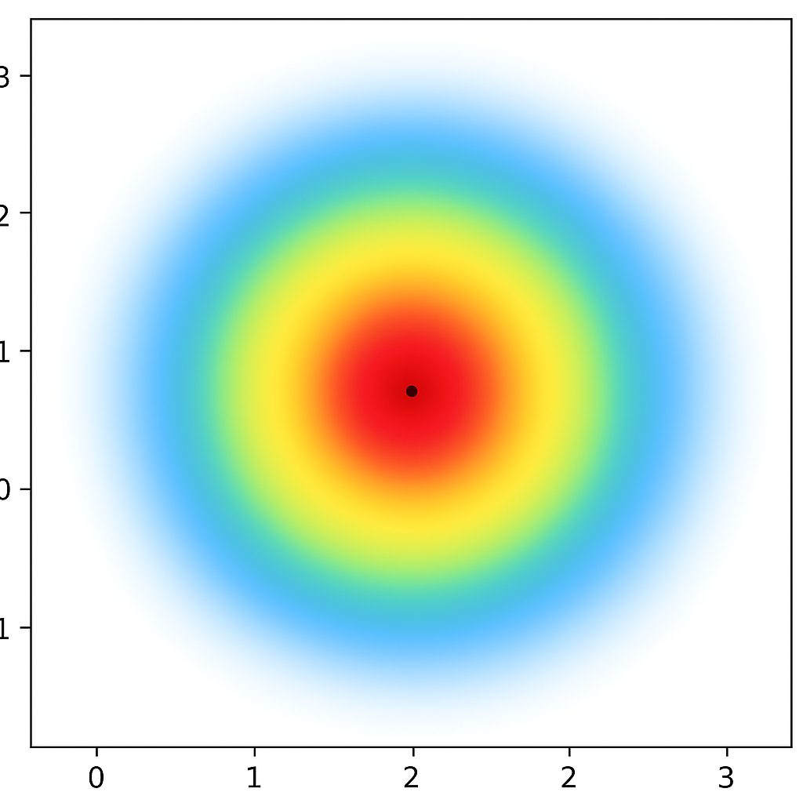

# ai-pillow-pressure-data-headmap-generator

本リポジトリは，AI枕プロジェクトにおいて，CSVに記録された圧力データから頭部の位置を推定し，二次元ヒートマップとして出力するシステムです．  
本ツールは，ユーザの頭部位置の可視化を通じて，AI枕のリアルタイム制御や適切な高さ・形状調整に役立てることを目的としています．

## 仕様

### 🎯 目的
- 枕にかかる圧力分布から頭部の位置を推定し，ヒートマップとして可視化することで今後の開発効率向上を目指す．
- 睡眠姿勢の分析や個人最適化アルゴリズム開発に応用する．

### 📄 入力
- 圧力センサ情報を含むCSVファイル
- 圧力データは左上のPressure1，右上のPressure2，左下のPressure3，右下のPressure4からなる4次元データ．

### 🧠 出力
- 頭部推定位置を中心としたヒートマップ画像（赤：高圧 → 青：低圧）
- データは4次元であるため，今回は頭の位置を推定し，**擬似的に円状のヒートマップ生成を想定している**．

### 💻 頭の位置推定式

頭の位置（x, y）は，各圧力センサの出力値とセンサの設置位置に基づいて，以下のように重み付き平均により算出されます：

\[
x = \frac{F_1 \cdot P_{1x} + F_2 \cdot P_{2x} + F_3 \cdot P_{3x} + F_4 \cdot P_{4x}}{F}
\]
\[
y = \frac{F_1 \cdot P_{1y} + F_2 \cdot P_{2y} + F_3 \cdot P_{3y} + F_4 \cdot P_{4y}}{F}
\]

- \( F_1, F_2, F_3, F_4 \)：それぞれの圧力センサからの圧力値  
- \( P_{ix}, P_{iy} \)：センサ \(i\) の設置位置（x, y座標）  
- \( F = F_1 + F_2 + F_3 + F_4 \)：総圧力

この式により，4点のセンサから得られる圧力の重心位置を求め，擬似的な頭部中心として扱います．

### ⚙️ 処理の流れ（想定している流れ）
1. **CSVファイル読み込み**
2. **加重平均により頭部の推定中心位置を算出**
3. **ヒートマップ画像を行ごとに生成（中心から赤→青グラデーション）**
4. **結果をPNG画像として保存**

### 🔧 実行環境
- Python 3.11.9
- 仮想環境（venv）での実行を推奨

### 🖼️ 出力イメージ例

## ライセンス
MIT License

## 開発者
佐藤 光河（Koga Sato）
